# ☁️ Azure Cloud Fundamentals and Data Pipeline Implementation using Azure Data Factory (ADF)


---

# 📌 Objective

The objective of this assignment is to understand Azure Cloud fundamentals and implement an end-to-end data pipeline using Azure Storage Account and Azure Data Factory (ADF). The project demonstrates how cloud storage, datasets, linked services, metadata validation, and data movement activities work together to build a complete cloud-based data engineering solution.

---

# 🛠 Technologies Used

- Microsoft Azure
- Azure Storage Account
- Azure Blob Storage
- Azure Data Factory (ADF)
- Azure RBAC (IAM)
- CSV Dataset
- Get Metadata Activity
- Copy Data Activity

---

# 📂 Project Workflow

```
CSV File
      │
      ▼
Azure Blob Storage
      │
      ▼
Linked Service
      │
      ▼
Source Dataset
      │
      ▼
Get Metadata Activity
      │
      ▼
Copy Data Activity
      │
      ▼
Destination Dataset
      │
      ▼
Azure Blob Storage
```

---

# Step 1 – Resource Group

A Resource Group named **RG_CEI_Week4** was created to organize all Azure resources in a single logical container. This simplifies deployment, management, monitoring, and lifecycle operations.

## Screenshot

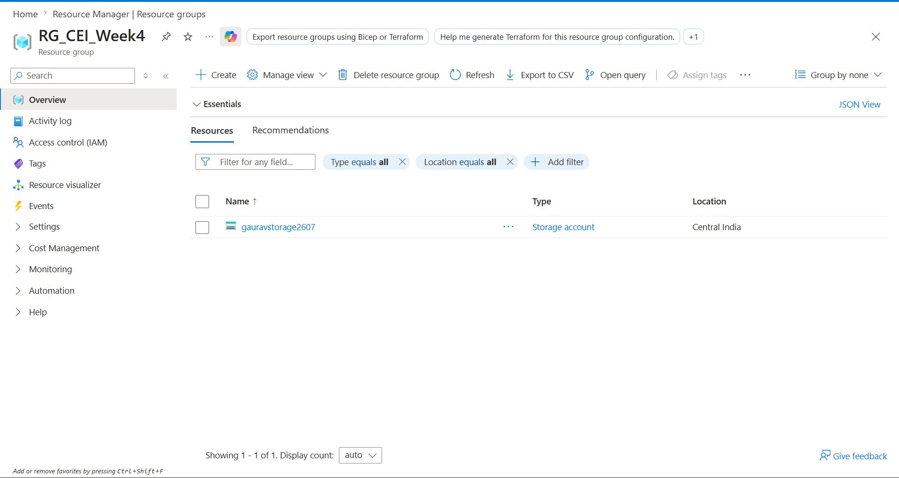

---

# Step 2 – Storage Account

A General Purpose v2 Storage Account named **gauravstorage2607** was created to securely store the datasets required for the pipeline.

## Screenshot

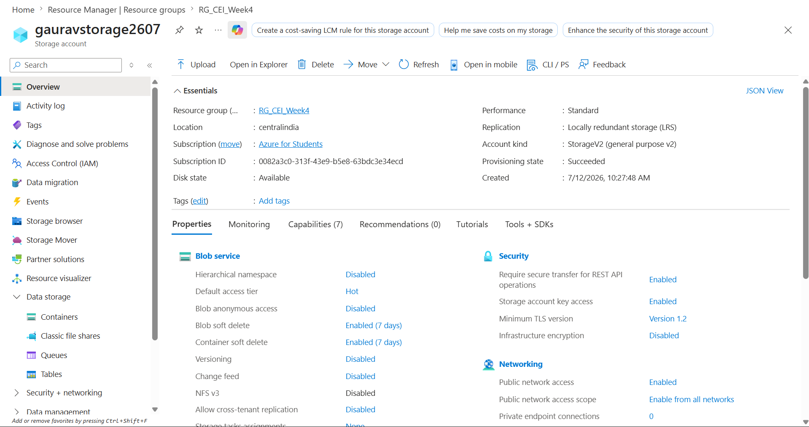

---

# Step 3 – Blob Container

A Blob Container named **superstore-data** was created for storing the source and destination CSV files.

## Screenshot

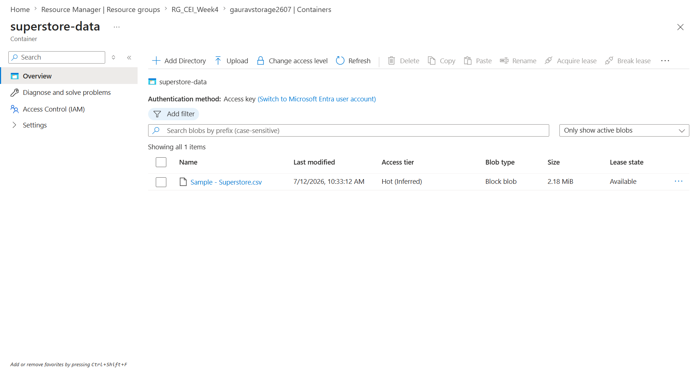

---

# Step 4 – Upload Dataset

The **Sample - Superstore.csv** dataset was uploaded successfully into Azure Blob Storage.

## Screenshot

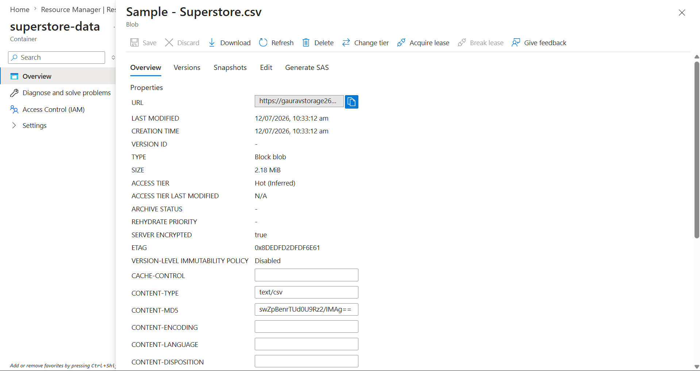

---

# Step 5 – Azure Data Factory

An Azure Data Factory instance (**adfgaurav2607**) was created to orchestrate the complete data integration pipeline.

ADF Studio was explored using:

- Author
- Monitor
- Manage

## Screenshot

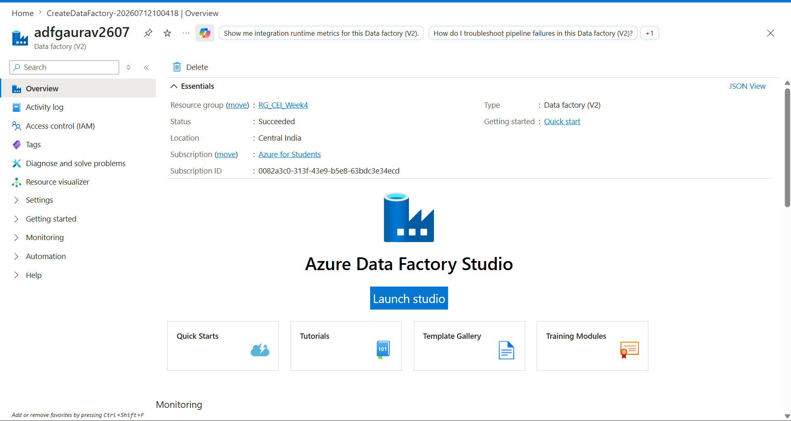

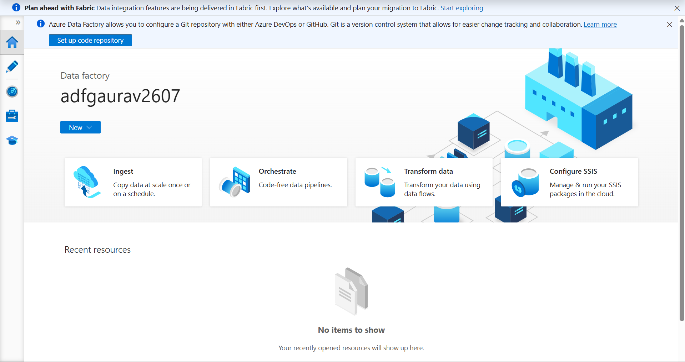

---

# Step 6 – Linked Service

A Linked Service (**LS_BlobStorage**) was created to establish a secure connection between Azure Data Factory and Azure Blob Storage.

## Screenshot

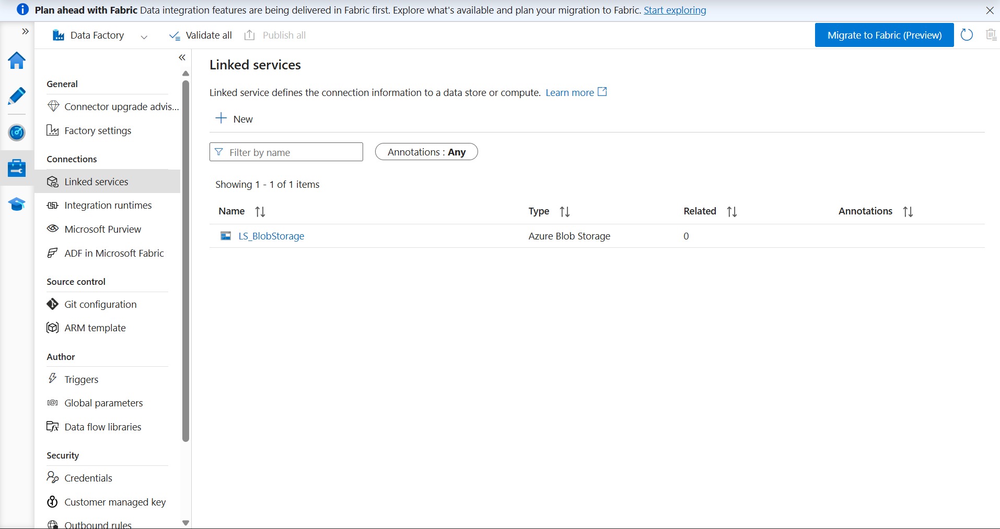

---

# Step 7 – Source Dataset

A source dataset (**DS_Source**) was created using Delimited Text format and connected to the uploaded CSV file.

## Screenshot

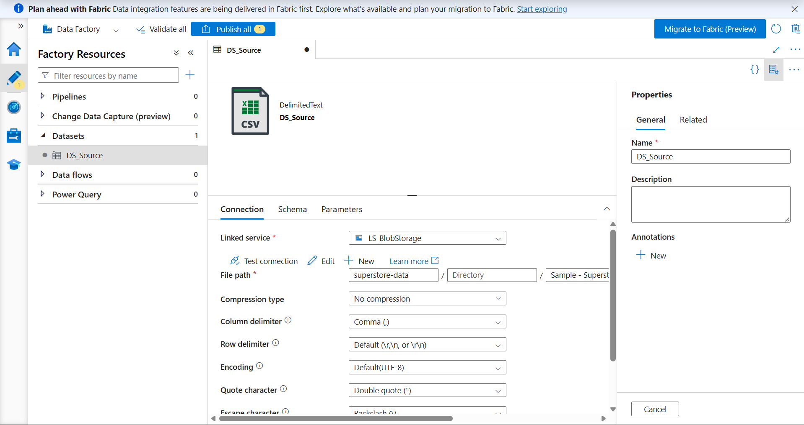

---

# Step 8 – Destination Dataset

A destination dataset (**DS_Destination**) was configured for storing the copied output file inside Blob Storage.

## Screenshot

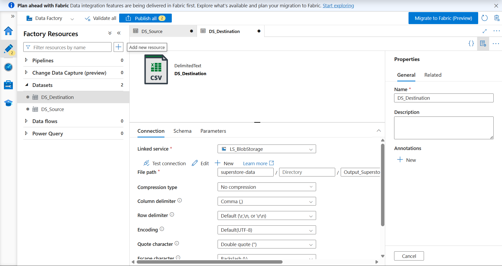

---

# Step 9 – Get Metadata Activity

The **Get Metadata** activity was configured to validate the source file before execution.

Metadata such as:

- File Exists
- File Size
- Last Modified

can be retrieved using this activity.

## Screenshot

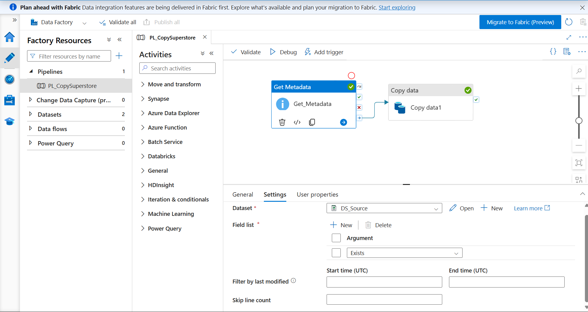

---

# Step 10 – Pipeline Design

The Azure Data Factory pipeline was designed by connecting the following activities:

- Get Metadata
- Copy Data

This ensures the source file is validated before being copied.

## Screenshot

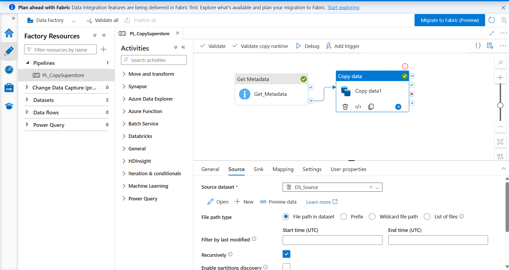

---

# Step 11 – Pipeline Execution

The pipeline was executed successfully using the **Debug** option.

Both activities completed successfully:

- ✅ Get Metadata
- ✅ Copy Data

## Screenshot

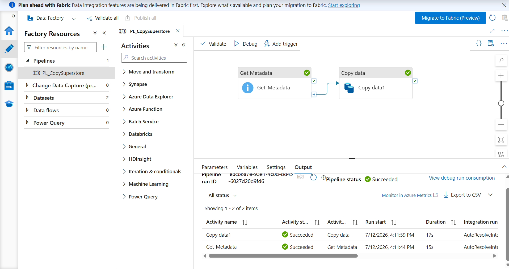

---

# Step 12 – Monitor Pipeline

The successful pipeline execution was verified in the **Monitor** section of Azure Data Factory.

The monitor provides:

- Pipeline Status
- Activity Status
- Execution Time
- Trigger Information

## Screenshot

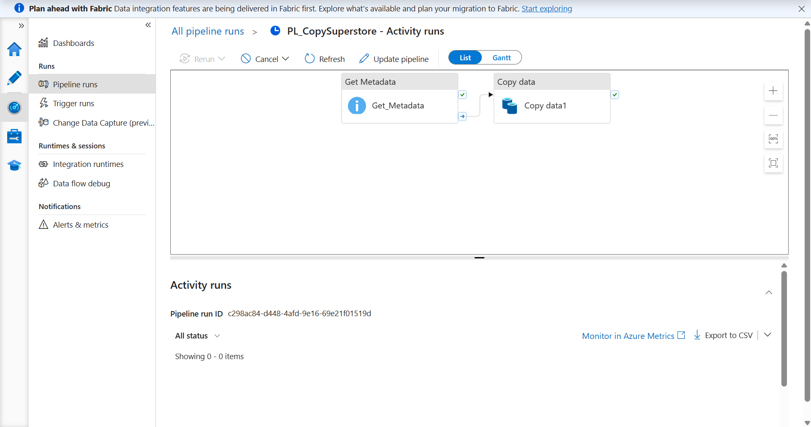

---

# Step 13 – Access Control (IAM)

Azure Role-Based Access Control (RBAC) was explored through the **Access Control (IAM)** section.

The assignment included understanding the following Azure roles:

- Owner
- Contributor
- Reader

## Screenshot

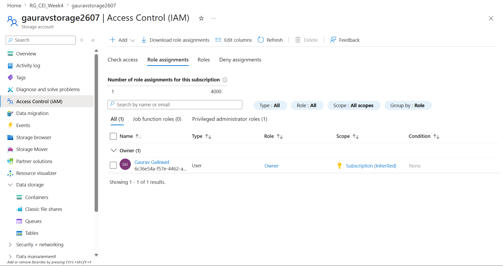

---

# Step 14 – Final Resources

Finally, the Resource Group was verified to ensure all Azure resources were successfully deployed.

Resources included:

- Azure Storage Account
- Azure Data Factory

## Screenshot

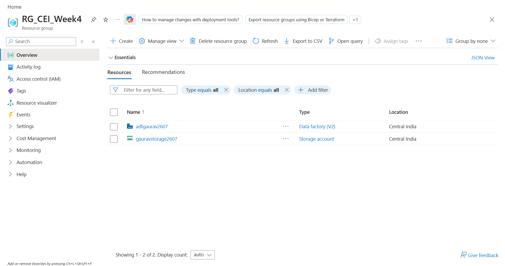

---

# 🎯 Key Learnings

During this assignment, the following Azure concepts were explored:

- Azure Resource Groups
- Azure Storage Account
- Azure Blob Storage
- Azure Data Factory
- Linked Services
- Source & Destination Datasets
- Get Metadata Activity
- Copy Data Activity
- Pipeline Monitoring
- Azure RBAC (IAM)

---

# 📌 Outcome

Successfully designed and implemented an end-to-end Azure cloud data engineering pipeline that:

- Created Azure cloud resources.
- Stored datasets using Azure Blob Storage.
- Connected Azure Data Factory with Storage Account.
- Configured source and destination datasets.
- Validated files using Get Metadata.
- Copied data using Copy Data Activity.
- Monitored successful execution.
- Verified Azure Role-Based Access Control.

The assignment provided practical exposure to Azure cloud fundamentals and demonstrated how Azure Data Factory can be used to build scalable, reliable, and production-ready cloud data integration pipelines.

---

# 👨‍💻 Author

**Gaurav Gaikwad**

GitHub: https://github.com/GauravGaikwad037

CEI Data Engineering Internship – Week 4 Assignment